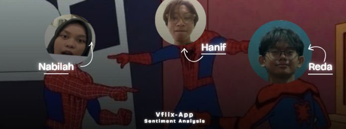
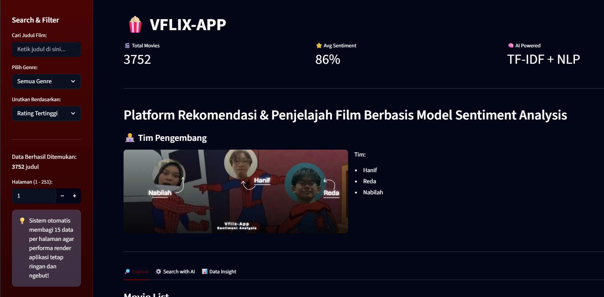
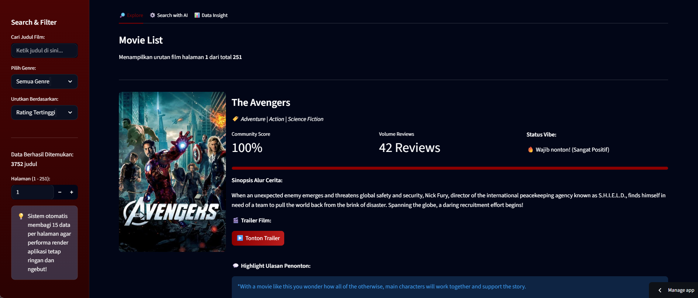

# 🍿 VFLIX-APP  
### AI-Based Movie Recommendation Platform

<p align="center">
  
</p>

<p align="center">
  
  
  
  
  
</p>

---

## 📖 About The Project

**VFLIX-APP** adalah platform rekomendasi film berbasis Artificial Intelligence yang dirancang untuk membantu pengguna menemukan film sesuai dengan *vibe*, suasana, atau alur cerita yang diinginkan.

Aplikasi ini memanfaatkan teknologi **Natural Language Processing (NLP)** dan **Sentiment Analysis** untuk menghasilkan rekomendasi yang lebih personal dan relevan. Pengguna dapat mencari film menggunakan deskripsi bebas seperti:

> *"good superman film"*  
> *"amazing scifi film"*

Sistem kemudian akan mencocokkan deskripsi tersebut menggunakan metode **TF-IDF** dan **Cosine Similarity**.

---

# ✨ Features

## 🔎 Explore & Filter
- Menjelajahi katalog film interaktif
- Filter berdasarkan genre
- Search judul film
- Sorting berdasarkan sentiment score

## ⚙️ AI Recommendation System
- Rekomendasi berbasis deskripsi teks (*vibe-based search*)
- Menggunakan:
  - TF-IDF Vectorization
  - Cosine Similarity
  - NLP preprocessing

## 🎥 Smart Trailer Integration
- Integrasi dengan **TMDB API**
- Menampilkan trailer YouTube langsung di aplikasi

## 📊 Data Visualization
- Visualisasi distribusi genre film
- Insight sederhana mengenai tren perfilman

---

# 📑 Cara Kerja

## 1. 📲 Startup & Inisialisasi
Saat aplikasi pertama kali dijalankan, Streamlit menjalankan seluruh app.py dari atas ke bawah. 
Ada tiga pemanggilan @st.cache / @st.cache_resource yang hanya dieksekusi sekali lalu disimpan di memori:
- load_movie_data() digunakan untuk membaca data/movies_scored_final.csv
- load_review_data() digunakan untuk membaca data/reviews_final.csv
- load_ai_models() digunakan untuk memuat dua file model dari folder models/: tfidf_rekomendasi.pkl (vectorizer) dan tfidf_matrix.pkl (matrix TF-IDF yang sudah diproses sebelumnya)
Setelah cache diisi, semua tab langsung menggunakan data yang sama dari memori tanpa membaca ulang dari disk.

## 2. 📧 Page Config & Header
st.set_page_config mengatur judul tab browser, layout wide, dan ikon. 
Kemudian CSS kustom diintegrasikan melalui st.markdown(..., unsafe_allow_html=True) untuk menyembunyikan menu bawaan Streamlit dan memberi tampilan sidebar merah gelap khas VFLIX.
Header menampilkan tiga metrik statis hardcoded (3752 film, 86% avg sentiment, TF-IDF + NLP) dan informasi tim pengembang beserta gambar dari assets/image.png.

## 3. Tab 1 — Explore (Katalog Film)
### Sidebar filter menyediakan empat kontrol input:
- Text input untuk pencarian judul (case-insensitive str.contains)
- Selectbox genre — genre diambil dinamis dengan memecah kolom genres yang dipisah koma, lalu dikumpulkan ke dalam set unik
- Selectbox urutan (tertinggi/terburuk berdasarkan avg_predicted_sentiment)
- Number input halaman

### Pipeline filter berjalan setiap kali user mengubah input:
- Drop baris yang avg_predicted_sentiment-nya null
- Filter judul jika ada query
- Filter genre jika bukan "Semua Genre"
- Sort berdasarkan pilihan
- Potong menggunakan slice iloc[start:end] untuk pagination 15 item/halaman

### Render kartu film dilakukan dalam loop for index, row in page_df.iterrows(). Setiap film menampilkan:
- Poster dari TMDB image CDN (https://image.tmdb.org/t/p/w500{poster_path})
- Skor sentimen dalam persen + progress bar + label vibe (4 kategori: ≥90%, ≥75%, ≥50%, sisanya)
- Sinopsis (overview)
- Trailer → memanggil render_trailer_section()
- Highlight review → filter df_reviews berdasarkan movie_id dan ambil baris pertama

## 4. Tab 2 — Search with AI
Cara kerja dari fitur rekomendasi berbasis NLP:
- User mengetik deskripsi bebas seperti plot, suasana, dan genre di st.text_area
- User menggeser slider rating ekspektasi (1–5)
- Saat tombol ditekan, teks user di-transform menggunakan tfidf_vec.transform([user_text]) untuk menghasilkan vektor sparse
- Vektor ini dibandingkan dengan tfidf_mat (matrix semua film) menggunakan cosine similarity
- Diambil 5 indeks dengan skor tertinggi via argsort()[-5:][::-1]
- Hasil disimpan ke st.session_state agar tidak hilang saat Streamlit re-run
- Render 5 kartu film dengan poster, skor kemiripan (%), progress bar, sinopsis, dan trailer

## 5. Fungsi Shared dengan render_trailer_section()
Fungsi ini dipakai oleh Tab 1 dan Tab 2. Cara kerjanya:
- Membuat key unik di st.session_state per film, misalnya show_trailer_katalog_42
- Tombol toggle mengubah state antara True/False
- Jika state True, baru memanggil get_trailer_key(movie_id)
- get_trailer_key() memanggil TMDB API endpoint /movie/{id}/videos, mencari item dengan type == "Trailer" dan site == "YouTube", lalu mengembalikan YouTube video key-nya
- Embed YouTube dirender via st.markdown dengan <iframe>

## 6. Tab 3 — Data Insight
Cara kerja dari fitur Data Insight yaitu:
- Mengambil kolom genres
- Memecah setiap nilai dengan str.split(',')
- Meratakan dengan .explode()
- Membersihkan spasi
- Menghitung frekuensi dengan .value_counts()
- Mengambil 10 teratas
- Lalu render dengan st.bar_chart()

---

# 🛠️ Tech Stack

| Category | Technology |
|---|---|
| Frontend | Streamlit |
| Backend | Python |
| Data Processing | Pandas |
| Machine Learning | Scikit-learn |
| NLP | TF-IDF |
| Model Persistence | Joblib |
| API Integration | TMDB API |

---

# 📂 Project Structure

```plaintext
├── .devcontainer/              # Konfigurasi container development
│   └── devcontainer.json       # Pengaturan environment VS Code Dev Container

├── .streamlit/                 # Konfigurasi Streamlit
│   └── config.toml             # Pengaturan tampilan & server Streamlit

├── assets/                     # Folder asset/gambar pendukung
│   └── image.png               # Preview atau banner aplikasi

├── data/                       # Dataset utama aplikasi
│   ├── cast.csv                # Data pemeran film
│   ├── crew.csv                # Data kru film
│   ├── genres.csv              # Data genre film
│   ├── movies.csv              # Dataset film mentah
│   ├── movies_scored_final.csv # Dataset film hasil scoring/sentiment
│   ├── reviews.csv             # Dataset review mentah
│   └── reviews_final.csv       # Dataset review hasil preprocessing

├── models/                     # Model Machine Learning tersimpan
│   ├── sentiment_model.pkl     # Model analisis sentimen
│   ├── tfidf_matrix.pkl        # Matrix TF-IDF hasil training
│   ├── tfidf_rekomendasi.pkl   # Model rekomendasi berbasis TF-IDF
│   └── tfidf_vectorizer.pkl    # TF-IDF Vectorizer

├── app.py                      # File utama aplikasi Streamlit
├── README.md                   # Dokumentasi proyek
└── requirements.txt            # Daftar dependensi Python
```

---

## 📓 Jupyter Notebook

[Click here to open the notebook](https://colab.research.google.com/drive/1GOuEtwZLgqbmRGwfs17vIdhakZ56ndb-?usp=sharing)

---

# 🚀 Live Demo

🔗 https://vflix-app.streamlit.app

---

# ⚙️ Installation

## 1️⃣ Clone Repository

```bash
git clone https://github.com/marcoreda2007-lgtm/vflix-app.git
cd vflix-app
```

---

## 2️⃣ Install Dependencies

Pastikan Python sudah terinstall.

```bash
pip install -r requirements.txt
```

---

## 3️⃣ Run The Application

```bash
streamlit run app.py
```

---

# 🔑 Environment Variables

Aplikasi membutuhkan API Key dari TMDB.

Buat file `.env` lalu tambahkan:

```env
TMDB_API_KEY=your_api_key_here
```

---

# 📸 Application Preview

<p align="center">
  
  
</p>

---

# 👨‍💻 Developer Team

| Name |
|---|
| Hanif |
| Reda |
| Nabilah |

---

# 📌 Notes

- Pastikan `TMDB_API_KEY` aktif agar fitur trailer berjalan normal.
- Direkomendasikan menggunakan Python 3.10+.
- Dataset yang digunakan telah melalui proses preprocessing dan sentiment scoring.

---

# ⭐ Support

Jika project ini membantu, jangan lupa kasih ⭐ di repository GitHub ya!

---
